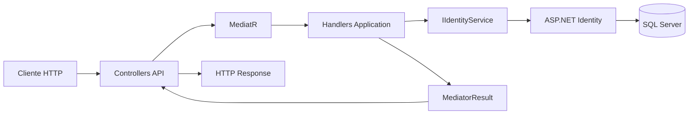
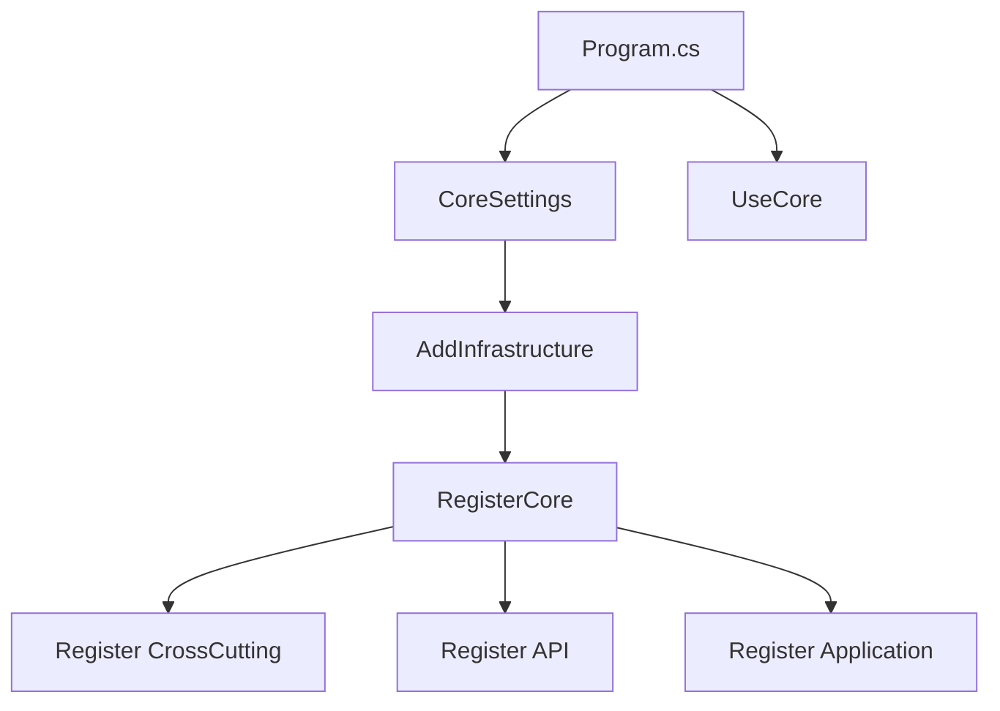
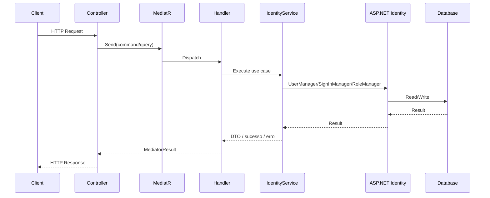
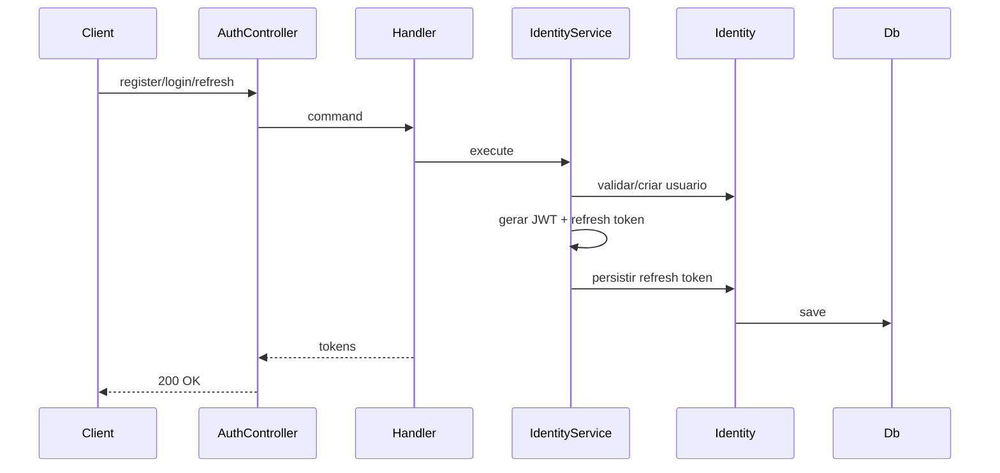
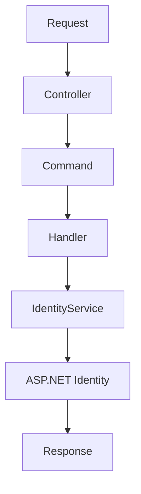
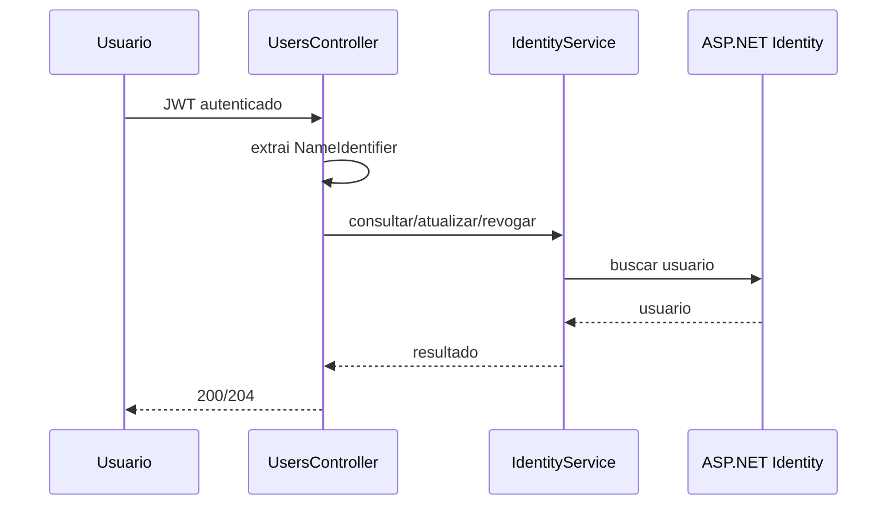
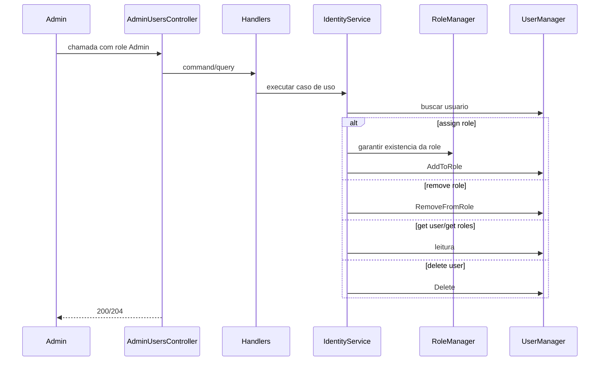
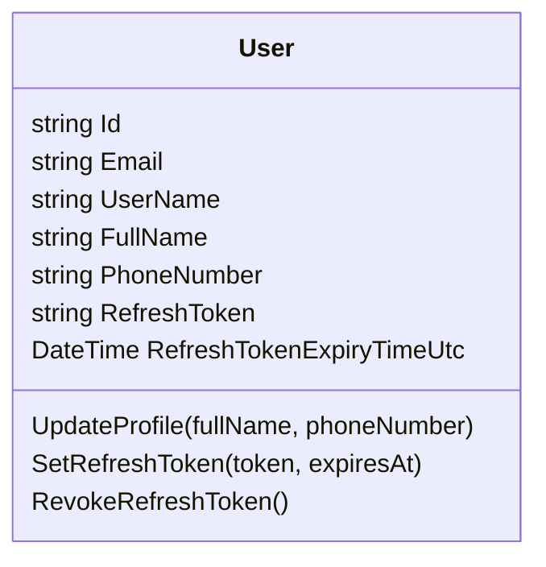

# CashControl Flows V2

Versao expandida do mapeamento de fluxos do sistema, com foco em:

- diagramas Mermaid
- sequencia por endpoint
- visao `as-is`
- visao `to-be`
- riscos e oportunidades de melhoria

Documento base:

- [README.flows.md](/C:/Projetos/CashControl/README.flows.md:1)

## Escopo

O sistema implementado no repositorio hoje e o microservico de identidade do CashControl.

Contextos cobertos:

- autenticacao
- emissao e renovacao de JWT
- refresh token
- perfil do usuario autenticado
- confirmacao de email
- recuperacao e reset de senha
- administracao de usuarios e roles

## Visao Executiva

### As-Is

Estado atual:

- arquitetura em camadas com boa separacao entre `API`, `Application`, `Domain`, `Infra` e `Core`
- autenticacao baseada em `ASP.NET Identity` + `JWT`
- rotas administrativas protegidas por role `Admin`
- testes de integracao cobrindo todos os endpoints publicos
- refresh token persistido no proprio usuario
- fluxo de reset e confirmacao feito diretamente pela API

### To-Be

Evolucoes naturais recomendadas:

- envio real de email para `confirm-email` e `forgot-password`
- expiracao/rotacao com historico de refresh token por dispositivo
- auditoria de operacoes administrativas
- segregacao mais explicita de casos de uso administrativos
- observabilidade com logs estruturados e correlation id
- politicas de senha e lockout alinhadas ao ambiente produtivo

## Diagrama Macro

## Diagrama De Inicializacao

## Fluxo Base De Request

## Pipeline Transversal

Arquivos relevantes:

- [Program.cs](/C:/Projetos/CashControl/src/Identity/CashControl.Identity.API/Program.cs:1)
- [Bootstrapper.cs](/C:/Projetos/CashControl/src/CashControl.Core/CrossCutting/Bootstrapper.cs:1)
- [ExceptionMiddleware.cs](/C:/Projetos/CashControl/src/CashControl.Core/API/ExceptionMiddleware.cs:1)
- [BaseControllerHelper.cs](/C:/Projetos/CashControl/src/CashControl.Core/API/BaseControllerHelper.cs:1)

### Ordem efetiva

1. `ExceptionMiddleware`
2. `DeveloperExceptionPage` no ambiente de desenvolvimento
3. `HealthChecks`
4. `Swagger`
5. `Routing`
6. `Authentication`
7. `Authorization`
8. `MapDefaultControllerRoute`

### Observacoes

- erros de negocio e validacao sobem como `CustomException` e viram `400`
- erros nao tratados viram `500`
- `MediatorResult` define o status final da resposta
- colecoes simples, como roles, sao serializadas corretamente

## Fluxos Por Dominio

## 1. Fluxos De Autenticacao

Endpoints:

- `POST /v1/auth/register`
- `POST /v1/auth/login`
- `POST /v1/auth/refresh-token`

### Diagrama

### As-Is

- `register` cria o usuario e ja retorna tokens
- `login` reemite tokens
- `refresh-token` usa o access token expirado para recuperar o usuario
- refresh token atual fica salvo no proprio usuario

### To-Be

- separar refresh token por dispositivo/sessao
- registrar `issued at`, `revoked at`, `device`, `ip`
- aplicar revogacao em cascata por suspeita de comprometimento

### Riscos

| Fluxo | Risco atual | Impacto | Sugestao |
|---|---|---|---|
| register | usuario recebe token mesmo sem email confirmado | medio | exigir confirmacao em ambiente produtivo |
| login | lockout configurado, mas sem politica explicita documentada | medio | documentar e parametrizar |
| refresh-token | token salvo direto na tabela do usuario | medio | mover para tabela de sessao/refresh token |

## 2. Fluxos De Credencial

Endpoints:

- `POST /v1/auth/forgot-password`
- `POST /v1/auth/reset-password`
- `POST /v1/auth/confirm-email`
- `POST /v1/users/me/change-password`

### Diagrama

### As-Is

- `forgot-password` retorna token diretamente na resposta
- `reset-password` consome token e nova senha
- `confirm-email` recebe `userId` e token
- `change-password` exige autenticacao e senha atual

### To-Be

- remover exposicao direta do token de reset na API
- integrar com email provider
- criar fluxo de expiracao e tentativa maxima de uso
- registrar auditoria de troca de senha

### Riscos

| Fluxo | Risco atual | Impacto | Sugestao |
|---|---|---|---|
| forgot-password | token sensivel trafega em resposta | alto | enviar por email e nunca devolver ao cliente final |
| confirm-email | fluxo funcional, mas sem notificacao externa | baixo | integrar envio de confirmacao |
| change-password | sem auditoria de evento | medio | registrar alteracao e origem |

## 3. Fluxos Do Usuario Autenticado

Endpoints:

- `GET /v1/users/me`
- `PUT /v1/users/me`
- `DELETE /v1/users/me/refresh-token`

### Diagrama

### As-Is

- `me` usa claim `NameIdentifier` como fonte unica do usuario corrente
- `update profile` atualiza nome e telefone
- `revoke refresh token` invalida a sessao de renovacao atual

### To-Be

- introduzir endpoint de logout total
- permitir revogacao de sessoes por dispositivo
- expor metadados da conta, como `emailConfirmed`

### Riscos

| Fluxo | Risco atual | Impacto | Sugestao |
|---|---|---|---|
| get me | depende integralmente das claims do token | baixo | manter token enxuto e confiavel |
| update me | sem versionamento otimista | baixo | considerar concurrency stamp explicito |
| revoke refresh token | revoga apenas o token atual do usuario | medio | suportar multissessao |

## 4. Fluxos Administrativos

Endpoints:

- `GET /v1/admin/users/{userId}`
- `GET /v1/admin/users/{userId}/roles`
- `PUT /v1/admin/users/{userId}/roles/{role}`
- `DELETE /v1/admin/users/{userId}/roles/{role}`
- `DELETE /v1/admin/users/{userId}`

### Diagrama

### As-Is

- autorizacao por role `Admin`
- atribuicao de role cria a role se ela ainda nao existir
- leitura de usuario retorna dados basicos e roles
- exclusao remove o usuario do store do Identity

### To-Be

- separar RBAC administrativo de roles de negocio
- introduzir trilha de auditoria
- bloquear exclusao de usuarios sistemicos
- impedir remocao da ultima role administrativa

### Riscos

| Fluxo | Risco atual | Impacto | Sugestao |
|---|---|---|---|
| assign role | role e criada dinamicamente sem governanca | medio | whitelist/catalogo de roles |
| remove role | sem regra de seguranca para roles criticas | medio | regras de protecao por role |
| delete user | exclusao direta sem soft delete | medio | avaliar desativacao ou soft delete |

## Sequencia Resumida Por Endpoint

| Endpoint | Entrada principal | Regra central | Persistencia | Saida |
|---|---|---|---|---|
| `POST /v1/auth/register` | email, senha, fullName | cria usuario e emite tokens | usuario + refresh token | `200` |
| `POST /v1/auth/login` | email, senha | valida credencial e emite tokens | refresh token | `200` |
| `POST /v1/auth/refresh-token` | access token expirado, refresh token | valida sessao e rotaciona tokens | refresh token | `200` |
| `POST /v1/auth/forgot-password` | email | gera token de reset | sem escrita | `200` |
| `POST /v1/auth/reset-password` | email, token, nova senha | troca senha | credencial | `204` |
| `POST /v1/auth/confirm-email` | userId, token | confirma email | estado do usuario | `204` |
| `GET /v1/users/me` | JWT | carrega usuario corrente | leitura | `200` |
| `PUT /v1/users/me` | nome, telefone | atualiza perfil | usuario | `204` |
| `POST /v1/users/me/change-password` | senha atual, nova senha | troca senha | credencial | `204` |
| `DELETE /v1/users/me/refresh-token` | JWT | revoga refresh token | usuario | `204` |
| `GET /v1/admin/users/{userId}` | userId | carrega usuario | leitura | `200` |
| `GET /v1/admin/users/{userId}/roles` | userId | consulta roles | leitura | `200` |
| `PUT /v1/admin/users/{userId}/roles/{role}` | userId, role | garante role e vincula | roles/usuario-role | `204` |
| `DELETE /v1/admin/users/{userId}/roles/{role}` | userId, role | remove role | usuario-role | `204` |
| `DELETE /v1/admin/users/{userId}` | userId | remove usuario | usuario | `204` |

## Modelo De Estado Do Usuario

Arquivo:

- [User.cs](/C:/Projetos/CashControl/src/Identity/CashControl.Identity.Domain/Entities/User.cs:1)

## Mapa De Componentes

| Componente | Responsabilidade |
|---|---|
| `Program` | composicao da aplicacao |
| `Bootstrapper` | configuracao de DI e pipeline |
| `Controllers` | adaptadores HTTP |
| `Commands/Queries` | contratos de caso de uso |
| `Handlers` | orquestracao da aplicacao |
| `IIdentityService` | porta de dominio/aplicacao |
| `IdentityService` | implementacao concreta de identidade |
| `UserManager` | operacoes de usuario |
| `SignInManager` | validacao de credencial |
| `RoleManager` | operacoes de role |
| `Context` | acesso ao banco |

## Cobertura De Testes

Os fluxos publicos estao cobertos por testes de integracao em:

- [AuthEndpointsTests.cs](/C:/Projetos/CashControl/tests/CashControl.Identity.API.IntegrationTests/AuthEndpointsTests.cs:1)
- [UserEndpointsTests.cs](/C:/Projetos/CashControl/tests/CashControl.Identity.API.IntegrationTests/UserEndpointsTests.cs:1)

Cobertura atual:

- todos os endpoints publicos
- caminhos felizes principais
- revogacao de refresh token
- reset de senha
- confirmacao de email
- gestao administrativa de roles e exclusao de usuario

## Backlog Arquitetural Recomendado

1. Externalizar `forgot-password` e `confirm-email` para um adaptador de notificacao.
2. Criar entidade explicita de sessao/refresh token.
3. Adicionar auditoria para `change-password`, `assign-role`, `remove-role` e `delete-user`.
4. Introduzir catalogo controlado de roles.
5. Adicionar politicas de seguranca por ambiente.
6. Evoluir responses para contratos publicos mais explicitos e versionados.

## Leitura Rapida

Se a intencao for entender o sistema rapidamente:

1. Leia [Program.cs](/C:/Projetos/CashControl/src/Identity/CashControl.Identity.API/Program.cs:1)
2. Leia [Bootstrapper.cs](/C:/Projetos/CashControl/src/CashControl.Core/CrossCutting/Bootstrapper.cs:1)
3. Leia os controllers em `API`
4. Leia [IdentityService.cs](/C:/Projetos/CashControl/src/Identity/CashControl.Identity.Infra/Services/IdentityService.cs:1)
5. Consulte este documento para riscos e evolucoes
