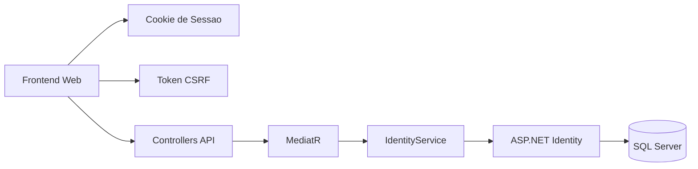
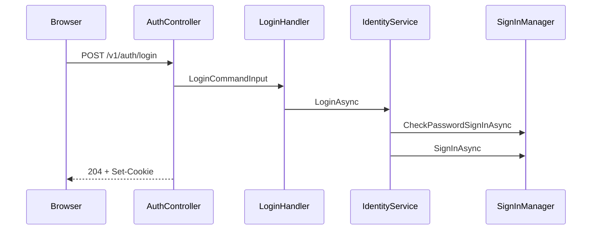
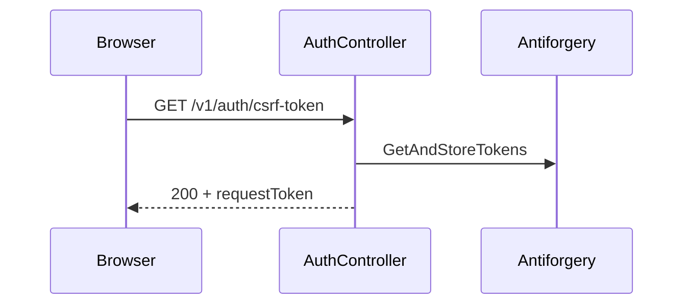
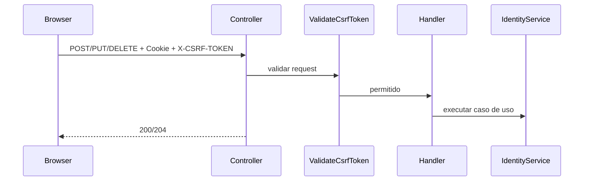
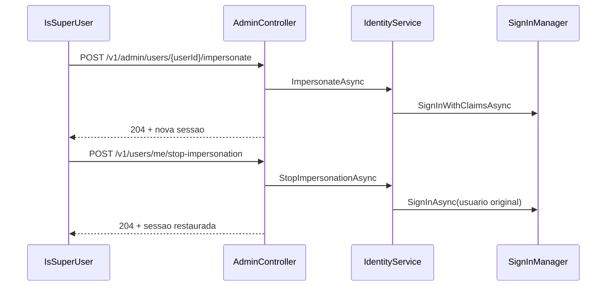

# CashControl Flows V2

Versao expandida dos fluxos de identidade, ja refletindo:

- sessao por cookie
- CSRF explicito
- impersonacao reversivel
- configuracao de deploy por ambiente

## Diagrama macro

## Pipeline HTTP

Ordem efetiva:

1. `ExceptionMiddleware`
2. `DeveloperExceptionPage` em desenvolvimento
3. `HealthChecks`
4. `Swagger`
5. `Routing`
6. `RateLimiter`
7. `Authentication`
8. `Authorization`
9. `MapDefaultControllerRoute`

## Fluxos principais

### Login

### CSRF

### Escrita autenticada

### Impersonacao

## Decisoes de seguranca

### Cookie de sessao

- nome padrao: `__Host-cashcontrol-session`
- `HttpOnly`
- `Secure`
- `SameSite` configuravel por ambiente
- `SlidingExpiration` configuravel

### Antiforgery

- header padrao: `X-CSRF-TOKEN`
- cookie padrao: `__Host-cashcontrol-csrf`
- validacao so em operacoes autenticadas de escrita
- resposta padronizada em caso de falha

### CORS e topologia

- `Cors:AllowedOrigins` define explicitamente quem pode usar a API web
- `AllowCredentials=true` para permitir cookie de sessao
- `DeploymentTopology` documenta origem publica do app e da API
- `UseHsts()` fora de `Development` e `Test`

## Pontos de atencao

1. Se o cookie continuar com prefixo `__Host-`, nao configure `Domain`.
2. A topologia mais simples para producao e app e API no mesmo site logico, por exemplo `app.cashcontrol.com` e `api.cashcontrol.com`.
3. Para clientes nao-browser, como mobile ou integracoes terceiras, este fluxo nao substitui automaticamente um modelo de token dedicado.
4. O privilegio global de sistema e controlado por `IsSuperUser`; a role `SuperAdmin` ficou apenas como identificador legado reservado.
5. O contrato publico da API nao expoe `IsSuperUser`; clientes recebem apenas capacidades derivadas necessarias para a UX.

## Estado atual

- autenticacao base pronta para web
- CSRF explicito implementado
- impersonacao reversivel implementada
- configuracao de cookie e CORS externalizada
- documentacao alinhada com o contrato atual
